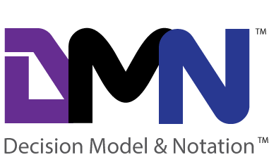

# DMN Testing Utility

A simple, yet effective command line utility for creating test scenario's for DMN models. DMN's can be tested entirely from Markdown documents.

## What is DMN?

For more information on DMN please visit: https://www.omg.org/spec/DMN/1.2/PDF

# Status

Currently creates tables and testing decision tables with single hit policies (U,A,P,F)

Single hit policies for single output decision tables are:

1.  Unique: no overlap is possible and all rules are disjoint. Only a single rule can be matched. This is the default.
2.  Any: there may be overlap, but all the matching rules show equal output entries for each output (ignoring rule
annotations), so any match can be used. If the output entries are non-equal (ignoring rule annotations), the hit
policy is incorrect and the result is undefined.
3.  Priority: multiple rules can match, with different output entries. This policy returns the matching rule with the highest
output priority. Output priorities are specified in the ordered list of output values, in decreasing order of priority.
Note that priorities are independent from rule sequence.
4. First: multiple (overlapping) rules can match, with different output entries. The first hit by rule order is returned (and
evaluation can halt). This is still a common usage, because it resolves inconsistencies by forcing the first hit.
However, first hit tables are not considered good practice because they do not offer a clear overview of the decision logic. It is important to distinguish this type of table from others because the meaning depends on the
order of the rules. The last rule is often the catch-remainder. Because of this order, the table is hard to validate
manually and therefore has to be used with care.
##### taken from OMG group DMN 1.2 specifications

## Dependencies

* Dot Net Core >= 2.2
* CommandLineParser >=2.4.3
* net.adamec.lib.common.dmn.engine >= 0.1.0
* Newtonsoft.Json" >= 12.0.1
* Camunda
* Docker

## Workings

To get you started, the following will describe a way of working with the command line utility in your project.

### Usage, best practices

#### DMN Modelling

An analist/developer typically models a decision model using DMN tools, such as available from:

* The Camunda Modeler (Desktop)
* The Camunda Dmn Simulator (Web)

Here's a graphical example of a decision model:


### Storing DMN for execution

DMN's are then stored, together with BPMN processes if any, in the Camunda Engine. For more information on running camunda from a docker image please visit this project: https://github.com/camunda/docker-camunda-bpm-platform

or quickly install it if you know what you are doing:

```bash
docker run -d --restart unless-stopped --name camunda -p 8081:8080 camunda/camunda-bpm-platform:latest
```
### Generate test templates


The commandline utility is able to discover all the DMN models that are stored in the Camunda engine. It does this by querying Camunda's RESTful API endpoint. Commands such as the endpoint needs to be added as a parameter to the Command Line utility using the -e flag. Here's an overview of the commands:

```shell

  -o, --operation    Required. Operation. 'create' for create test table for decision model.

  -k, --key          Key of the decision model top operate on.

  -e, --endpoint     Endpoint url to the camunda rest api. i.e.: http://localhost:8080/engine-rest

  -m, --markdown     Path to markdown file used as test input.

  --help             Display this help screen.

  --version          Display version information.
```

i.e:

```bash
foo@bar:docker run --rm=true --name dmn-test -v /home/$USER:/tmp wigo4it/dmn-test -o create -k invoiceClassification -e http://192.168.178.50:8080/engine-rest -m /tmp/testtemplate.md
```

Here's the output of that command in [testtemplate.md](src/dmn-test/testtemplate.md)

This utility will discover all the input / output parameters of your models and create empty test stubs for you in the form of markdown tables, which you can then fill in with test data. These markdown files are easily used in your own source code projects.

#### Test Tables

Here's an example of a test table that is discoverable by this utility from your project's markdown files.

```markdown
## dmn:invoiceClassification
| Invoice Amount | Invoice Category | *Classification                  |!|
|---------------:|:-----------------|:--------------------------------:|:|
| 200            | "Misc"           | "day-to-day expense"             |O|
| 250            | "Misc"           | "budget"                         |X|
| 10000          | "Misc"           | "exceptional"                    |O|
```
In this test scenario, the test data is provided in the 'Invoice Amount' and 'Invoice Category' columns. The columns are input parameters for the DMN table in Camunda. The expected output values are denoted in the 'Classification' column. Notice the asterisk * in front of the column name. This means the utlity treats this as an output parameter.

The last column '!' contains the test results.

| Invoice Amount | Invoice Category | *Classification                  | ! |
|---------------:|:-----------------|:--------------------------------:|:-:|
| 200            | "Misc"           | "day-to-day expense"             |&#x1F49A;|
| 250            | "Misc"           | "budget"                         |&#x1F534;|
| 10000          | "Misc"           | "exceptional"                    |&#x1F49A;|
##### actual visualization in markdown

#### Testing a table using the command line

i.e:

```bash
foo@bar:docker run --rm=true --name dmn-test -v /home/$USER:/tmp wigo4it/dmn-test -o test -k invoiceClassification -e http://192.168.178.50:8080/engine-rest -m /tmp/testtemplate.md
```

### Example of a session

[](https://www.youtube.com/watch?v=oncusmZtPuM)

### DMN Interpretation and execution

C# Dmn engine is used for interpreting metadata from the DMN model. Camunda is actually used for execution. While the C# Dmn engine can execute only FEEL expressions, Camunda also has support for more advanced expressions for interpreters such as Groovy Script.

